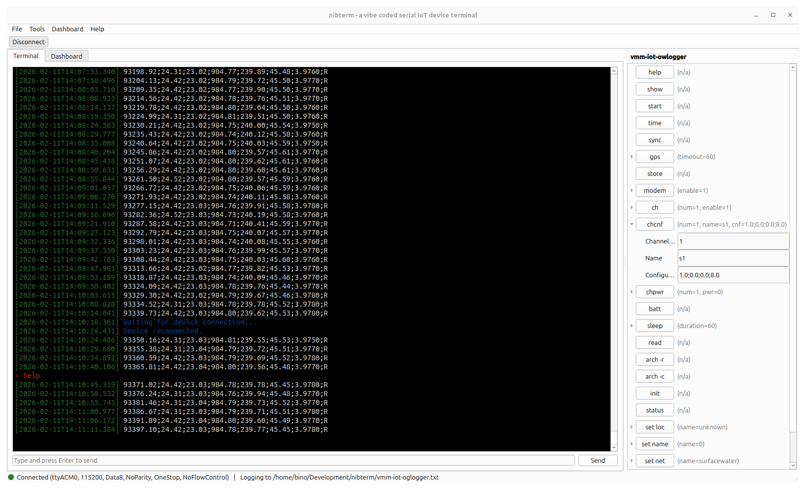
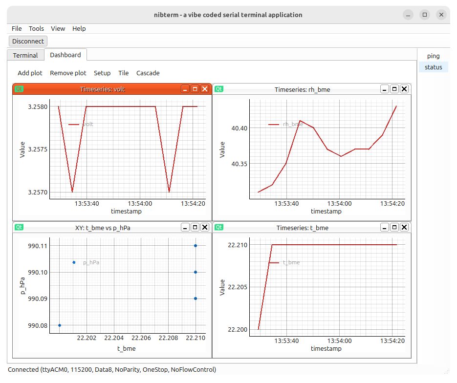

# nibTerm

PySide6 serial terminal for IoT devices with logging, plotting, and command presets. 

I vibe-coded this as a test and because I was not happy with existing terminal applications for my IoT work. I needed something which allows to define buttons with parameters to interact with the firmware, has plotting functionality (for monitoring device sensors via the serial line) as well as auto-reconnect for when the IoT device sleeps & attaches/detaches the Serial line. 

So this is my vibe-coded attempt to create something which ticks all those boxes. Screenshots of some version below. 

<p align="center">
  
  
</p>


## Features

- Serial connection with configurable port settings
- Local echo, send-on-enter, auto reconnect, timestamp prefix
- Terminal theming (font and colors)
- Log incoming data to file
- Real-time plotting via pyqtgraph (CSV-like lines)
- YAML command presets with configurable parameters that render as buttons in the UI

## Getting started

I haven't wrapped this in an installer yet, so you'll have to run it from source for now. Fortunately, this is easy. The tool uses python & the `uv` package manager. So you'll need to install these first. 

- Python 3.12+
- [uv](https://docs.astral.sh/uv/)

follow the instructions on the site to install `uv` and make sure it's in your `$PATH` (or equivalent on the OS you are working on). 

Next, clone the repository, move to the folder & create the python environment. 

```bash
git clone https://github.com/binomaiheu/nibterm.git
cd nibterm
uv sync
```

This should build the environment, probably in `.venv`, with the required python dependencies like PySide6 etc... To run the tool, simply execute : 

```bash
uv run nibterm
```

from the same folder. Or if you have activated the python environment instead, you can just run the tool as is. 

```bash
source .venv/bin/activate
nibterm
```

it is also possible to compile the tool to a standalone executable. this is done via : 


```
pyinstaller --windowed --name nibterm --onefile run.py
```

the exe will be in `dist`

## Usage

- Open **View → Data Pipeline** to set delimiter, column names, and transformations.
- Use the **Connection** toolbar button to connect/disconnect a serial port.
- Send commands from the input field or load a YAML preset from **File → Load preset...**.
- Switch to the **Dashboard** tab to add plots and use **Setup** per plot.
- Start logging from **Tools → Start logging...**.

### Presets

Below is a yaml configuration example for a preset which can be loaded into the tool. The idea behind presets is that you load a set of commands with optional parameters which will show up as a list of buttons for easy interaction with the firmware via the serial port. 

In the yaml file, you can define what's behind the buttons. Load the presets via `File > Load preset...`.

```yaml
# Preset for vmm-iot-owlogger
name: vmm-iot-owlogger
commands:
  - label: Reset
    command: "rst\n"
    description: Reboot the device.
    color: "#ffe0b2"
  - label: Temp
    command: "temp\n"
    description: Read current temperature.
  - label: Status
    command: "status\n"
    description: Request device status.
    color: "#e3f2fd"
  - label: Set PWM
    command: "pwm {duty} {freq}\n"
    description: Configure PWM output.
    params:
      - name: duty
        label: Duty (%)
        default: "50"
        description: Duty cycle percentage.
      - name: freq
        label: Frequency (Hz)
        default: "1000"
        description: PWM frequency in Hertz.
```

