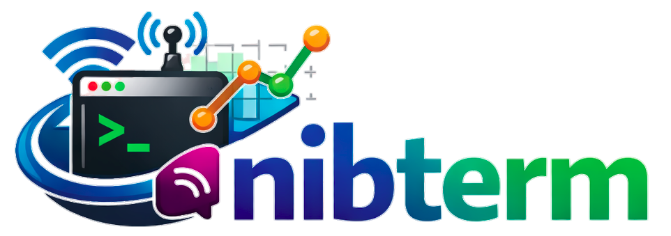
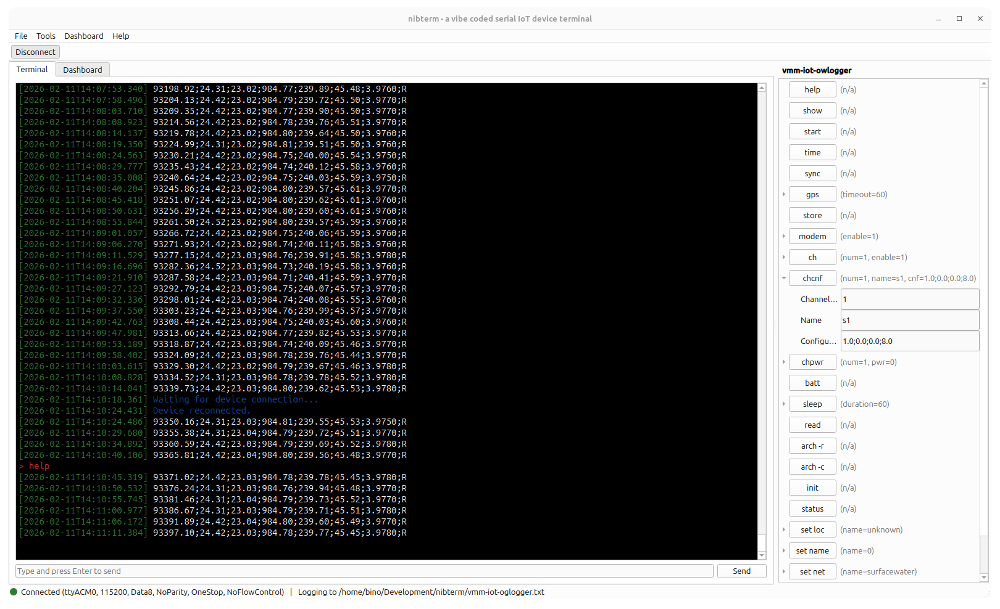
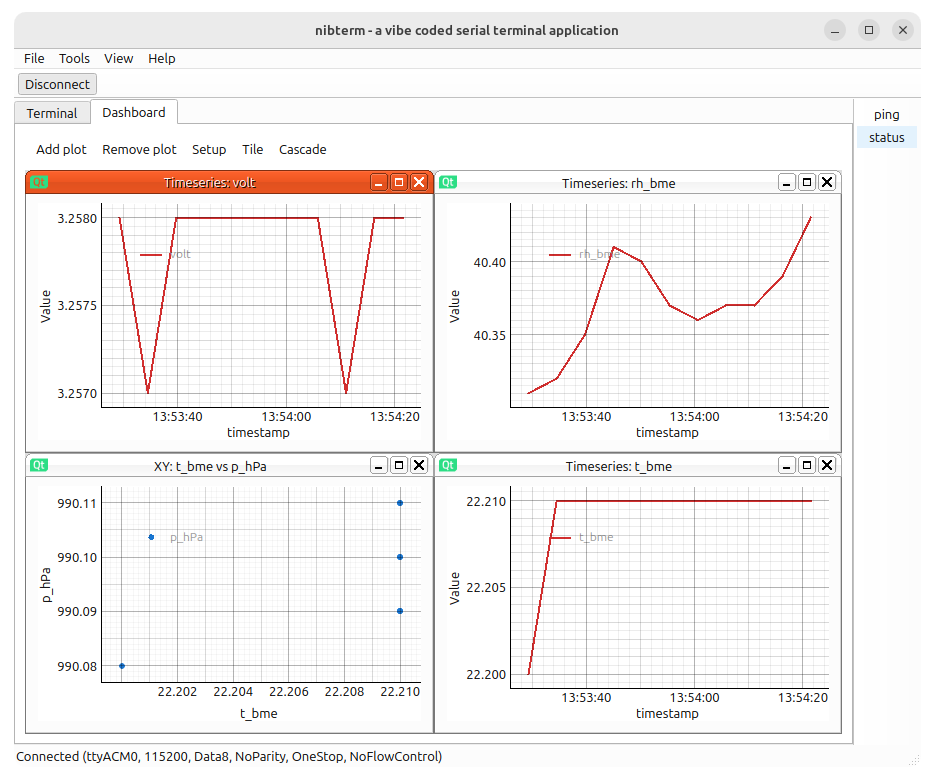

<p align="center">
  
</p>

<p align="center">
  <a href="https://github.com/binomaiheu/nibterm/releases/latest"></a>
  
  
  
  <a href="https://github.com/binomaiheu/nibterm/stargazers"></a>
  <a href="https://github.com/binomaiheu/nibterm/issues"></a>
</p>

---

A **PySide6 serial & MQTT terminal** for IoT devices with logging, real-time plotting, and command presets.

I vibe-coded this as a test and because I was not happy with existing terminal applications for my IoT work. I needed something which allows to define buttons with parameters to interact with the firmware, has plotting functionality (for monitoring device sensors via the serial line) as well as auto-reconnect for when the IoT device sleeps & attaches/detaches the Serial line.

So this is my vibe-coded attempt to create something which ticks all those boxes. Screenshots of some version below.

<p align="center">
  
  
</p>

## Features

- **Serial terminal** — configurable port, baud rate, data/parity/stop bits, flow control
- **MQTT monitor** — connect to brokers, browse topics, extract variables from payloads
- **Flexible parsers** — CSV, JSON, or per-variable regex extraction
- **Transforms** — computed variables from math expressions (unit conversions, sensor fusion)
- **Live dashboard** — real-time time-series and XY plots via pyqtgraph
- **Command presets** — YAML-defined buttons with parameters and flag toggles
- **Firmware upload** — flash firmware to devices using configurable toolchains (avrdude, bossac, etc.)
- Local echo, send-on-enter, auto-reconnect, timestamp prefix, DTR on connect
- Terminal theming (font and colors)
- Log incoming data to file

## Getting started

I haven't wrapped this in an installer yet, so you'll have to run it from source for now. Fortunately, this is easy. The tool uses python & the `uv` package manager. So you'll need to install these first. 

- Python 3.12+
- [uv](https://docs.astral.sh/uv/)

follow the instructions on the site to install `uv` and make sure it's in your `$PATH` (or equivalent on the OS you are working on). 

Next, clone the repository, move to the folder & create the python environment. 

```bash
git clone https://github.com/binomaiheu/nibterm.git
cd nibterm
uv sync
```

This should build the environment, probably in `.venv`, with the required python dependencies like PySide6 etc... To run the tool, simply execute : 

```bash
uv run nibterm
```

Pass `-v` or `--verbose` to enable debug logging (useful for diagnosing serial port issues):

```bash
uv run nibterm -v
```

from the same folder. Or if you have activated the python environment instead, you can just run the tool as is. 

```bash
source .venv/bin/activate
nibterm
```

it is also possible to compile the tool to a standalone executable. On Linux/macOS:

```
pyinstaller --windowed --name nibterm --onefile --icon=static/nibterm-icon.ico --add-data "static:static" --hidden-import PySide6.QtSerialPort run.py
```

On Windows (note the `;` separator for `--add-data`):

```
pyinstaller --windowed --name nibterm --onefile --icon=static/nibterm-icon.ico --add-data "static;static" --hidden-import PySide6.QtSerialPort run.py
```

Alternatively, use the provided `nibterm.spec` file which works on all platforms:

```
pyinstaller nibterm.spec
```

the exe will be in `dist`

## Usage

- Open **View → Data Pipeline** to set delimiter, column names, and transformations.
- Use the **Connection** toolbar button to connect/disconnect a serial port.
- Send commands from the input field or load a YAML preset from **File → Load preset...**.
- Switch to the **Dashboard** tab to add plots and use **Setup** per plot.
- Start logging from **Tools → Start logging...**.

### Firmware upload

The **Firmware** tab lets you flash firmware binaries to connected devices directly from nibterm. Configure a YAML toolchain file that defines the upload tool, arguments, and where firmware files live.

```yaml
firmware_folder: "/path/to/firmware"
log_folder: "/path/to/logs"

devices:
  - name: owlogger
    label: "VMM IoT OWLogger"
    executable: avrdude
    args: "-v -p m1284p -c arduino -P {port} -b 57600 -D -U flash:w:{firmware}:i"
    firmware_folder: "/path/to/firmware/owlogger"
    version_pattern: 'firmware-v(\d+\.\d+\.\d+)/firmware\.hex$'
    file_glob: "**/firmware.hex"
```

Key features:
- **Per-device firmware folders** — each device can override the global `firmware_folder`
- **Version-tagged subdirectories** — use `**/` in `file_glob` and a `version_pattern` that matches directory names to organize firmware in folders like `firmware-v1.13.0/firmware.hex`
- **Automatic port release** — if the serial terminal is connected to the upload port, nibterm releases it automatically
- **Live progress** — upload tool output (including progress bars) is shown in real time
- **Upload logging** — optional timestamped log files for each upload

Use `{port}` and `{firmware}` as placeholders in the `args` template. See `config_example/firmware_toolchains.yaml` for a complete example and `Help → Firmware upload` for full documentation.

### Presets

Below is a yaml configuration example for a preset which can be loaded into the tool. The idea behind presets is that you load a set of commands with optional parameters which will show up as a list of buttons for easy interaction with the firmware via the serial port. 

In the yaml file, you can define what's behind the buttons. Load the presets via `File > Load preset...`.

```yaml
# Preset for vmm-iot-owlogger
name: vmm-iot-owlogger
commands:
  - label: Reset
    command: "rst\n"
    description: Reboot the device.
    color: "#ffe0b2"
  - label: Temp
    command: "temp\n"
    description: Read current temperature.
  - label: Status
    command: "status\n"
    description: Request device status.
    color: "#e3f2fd"
  - label: Set PWM
    command: "pwm {duty} {freq}\n"
    description: Configure PWM output.
    params:
      - name: duty
        label: Duty (%)
        default: "50"
        description: Duty cycle percentage.
      - name: freq
        label: Frequency (Hz)
        default: "1000"
        description: PWM frequency in Hertz.
```

---

<p align="center">
  Built with Python & PySide6 &bull; vibe-coded with <a href="https://claude.ai">Claude</a>
</p>
